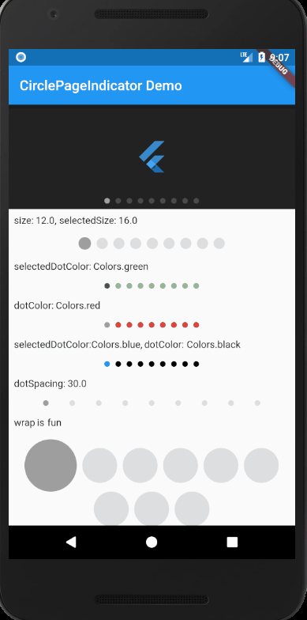
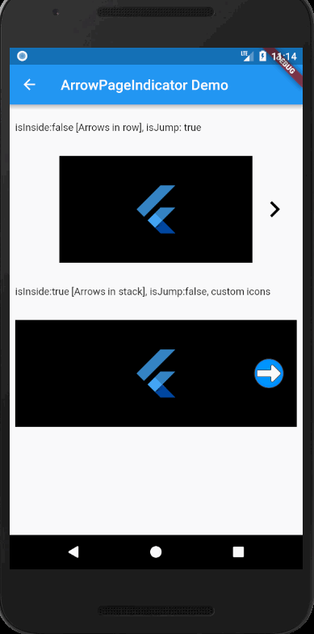

# page_view_indicators

Customizable indicators for your PageViews:

- CirclePageViewIndicator with following customizations:
    - size
    - selectedSize
    - dotColor
    - selectedDotColor
    - dotSpacing

- ArrowPageViewIndicator with following customization:
    - rightIcon
    - leftIcon
    - iconColor
    - iconPadding
    - duration
    - curve
    - isJump
    - isInside
    - iconSize
    - tooltipLeft
    - tooltipRight

- Others are coming soon!

## Example:




```dart
import 'package:flutter/material.dart';
import 'package:page_view_indicators/circle_page_indicator.dart';

void main() => runApp(MyApp());

class MyApp extends StatelessWidget {
  @override
  Widget build(BuildContext context) {
    return MaterialApp(
      title: 'PageViewIndicators Demo',
      theme: ThemeData(
        primarySwatch: Colors.blue,
      ),
      routes: {
        '/': (context) => HomePage(),
      },
    );
  }
}

class HomePage extends StatefulWidget {
  @override
  HomePageState createState() {
    return new HomePageState();
  }
}

class HomePageState extends State<HomePage> {
  final _items = [
    Colors.blue,
    Colors.orange,
    Colors.green,
    Colors.pink,
    Colors.red,
    Colors.amber,
    Colors.brown,
    Colors.yellow,
    Colors.blue,
  ];
  final _pageController = PageController();
  final _currentPageNotifier = ValueNotifier<int>(0);
  final _boxHeight = 150.0;

  @override
  Widget build(BuildContext context) {
    return Scaffold(
      appBar: AppBar(
        title: Text('CirclePageIndicator Demo'),
      ),
      body: _buildBody(),
    );
  }

  _buildBody() {
    return Column(
      children: <Widget>[
        Stack(
          children: <Widget>[
            _buildPageView(),
            _buildCircleIndicator(),
          ],
        ),
        Expanded(
          child: ListView(
            children: <Widget>[
              Text('size: 12.0, selectedSize: 16.0'),
              _buildCircleIndicator2(),
              Text('selectedDotColor: Colors.green'),
              _buildCircleIndicator3(),
              Text('dotColor: Colors.red'),
              _buildCircleIndicator4(),
              Text('selectedDotColor:Colors.blue, dotColor: Colors.black'),
              _buildCircleIndicator5(),
              Text('dotSpacing: 30.0'),
              _buildCircleIndicator6(),
              Text('wrap is fun'),
              _buildCircleIndicator7(),
            ]
                .map((item) => Padding(
                      child: item,
                      padding: EdgeInsets.all(8.0),
                    ))
                .toList(),
          ),
        ),
      ],
    );
  }

  _buildPageView() {
    return Container(
      color: Colors.black87,
      height: _boxHeight,
      child: PageView.builder(
          itemCount: _items.length,
          controller: _pageController,
          itemBuilder: (BuildContext context, int index) {
            return Center(
              child: FlutterLogo(
                colors: _items[index],
                size: 50.0,
              ),
            );
          },
          onPageChanged: (int index) {
            _currentPageNotifier.value = index;
          }),
    );
  }

  _buildCircleIndicator() {
    return Positioned(
      left: 0.0,
      right: 0.0,
      bottom: 0.0,
      child: Padding(
        padding: const EdgeInsets.all(8.0),
        child: CirclePageIndicator(
          itemCount: _items.length,
          currentPageNotifier: _currentPageNotifier,
        ),
      ),
    );
  }

  _buildCircleIndicator2() {
    return CirclePageIndicator(
      size: 16.0,
      selectedSize: 18.0,
      itemCount: _items.length,
      currentPageNotifier: _currentPageNotifier,
    );
  }

  _buildCircleIndicator3() {
    return CirclePageIndicator(
      selectedDotColor: Colors.green,
      itemCount: _items.length,
      currentPageNotifier: _currentPageNotifier,
    );
  }

  _buildCircleIndicator4() {
    return CirclePageIndicator(
      dotColor: Colors.red,
      itemCount: _items.length,
      currentPageNotifier: _currentPageNotifier,
    );
  }

  _buildCircleIndicator5() {
    return CirclePageIndicator(
      dotColor: Colors.black,
      selectedDotColor: Colors.blue,
      itemCount: _items.length,
      currentPageNotifier: _currentPageNotifier,
    );
  }

  _buildCircleIndicator6() {
    return CirclePageIndicator(
      dotSpacing: 30.0,
      itemCount: _items.length,
      currentPageNotifier: _currentPageNotifier,
    );
  }

  _buildCircleIndicator7() {
    return CirclePageIndicator(
      size: 50.0,
      selectedSize: 75.0,
      itemCount: _items.length,
      currentPageNotifier: _currentPageNotifier,
    );
  }
}

```

## ArrowPageIndicator



```dart
import 'package:flutter/material.dart';
import 'package:page_view_indicators/arrow_page_indicator.dart';

class ArrowPageIndicatorDemo extends StatefulWidget {
  @override
  ArrowPageIndicatorDemoState createState() {
    return new ArrowPageIndicatorDemoState();
  }
}

class ArrowPageIndicatorDemoState extends State<ArrowPageIndicatorDemo> {
  final _items = [
    Colors.blue,
    Colors.orange,
    Colors.green,
    Colors.pink,
  ];
  final _pageController = PageController();
  final _pageController2 = PageController();
  final _currentPageNotifier = ValueNotifier<int>(0);
  final _currentPageNotifier2 = ValueNotifier<int>(0);
  final _boxHeight = 150.0;

  @override
  Widget build(BuildContext context) {
    return Scaffold(
      appBar: AppBar(
        title: Text('ArrowPageIndicator Demo'),
      ),
      body: _buildBody(),
    );
  }

  _buildBody() => ListView(
        padding: EdgeInsets.all(8.0),
        children: <Widget>[
          Text('isInside:false [Arrows in row], isJump: true'),
          ArrowPageIndicator(
            isJump: true,
            pageController: _pageController,
            currentPageNotifier: _currentPageNotifier,
            itemCount: _items.length,
            child: _buildPageView(_pageController, _currentPageNotifier),
          ),
          Text('isInside:true [Arrows in stack], isJump:false, custom icons'),
          ArrowPageIndicator(
            iconPadding: EdgeInsets.symmetric(horizontal: 16.0),
            isInside: true,
            leftIcon: Image.asset(
              "assets/images/left_arrow.png",
              width: 46.0,
              height: 46.0,
            ),
            rightIcon: Image.asset(
              "assets/images/right_arrow.png",
              width: 46.0,
              height: 46.0,
            ),
            /* rightIcon: Icon(
              Icons.arrow_right,
              color: Colors.white,
              size: 90.0,
            ),
            leftIcon: Icon(
              Icons.arrow_left,
              color: Colors.white,
              size: 90.0,
            ),*/
            pageController: _pageController2,
            currentPageNotifier: _currentPageNotifier2,
            itemCount: _items.length,
            child: _buildPageView(_pageController2, _currentPageNotifier2),
          ),
        ]
            .map((item) => Padding(
                  child: item,
                  padding: EdgeInsets.symmetric(vertical: 16.0),
                ))
            .toList(),
      );

  _buildPageView(
          PageController pageController, ValueNotifier currentPageNotifier) =>
      Container(
        color: Colors.black,
        height: _boxHeight,
        child: PageView.builder(
            itemCount: _items.length,
            controller: pageController,
            itemBuilder: (BuildContext context, int index) {
              return Center(
                child: FlutterLogo(
                  colors: _items[index],
                  size: 75.0,
                ),
              );
            },
            onPageChanged: (int index) {
              currentPageNotifier.value = index;
            }),
      );
}
```

## Credits

[Left Icon](https://www.iconfinder.com/icons/173181/arrow_circle_left_icon)

[Right icon](https://www.iconfinder.com/icons/173182/arrow_circle_right_icon)